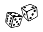

DiceGame
--------
#### GAME RULES:
- The game has 2 players, playing in rounds
- In each turn, a player rolls a dice as many times as he whishes. Each result get added to his ROUND score
- BUT, if the player rolls a 1, all his ROUND score gets lost. After that, it's the next player's turn
- The player can choose to 'Hold', which means that his ROUND score gets added to his GLOBAL score. After that, it's the next player's turn
- The first player to reach 50 points on GLOBAL score wins the game
- If the users want to play to a score other than 50, they can simply enter the Global score of their choice in the input field "Final Score"
